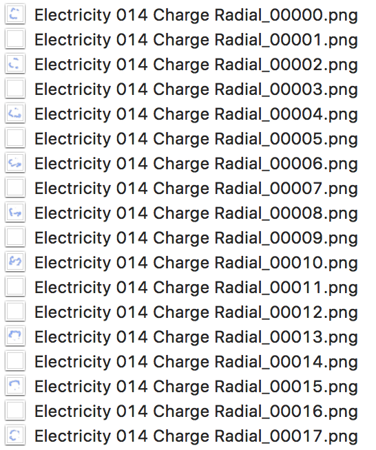
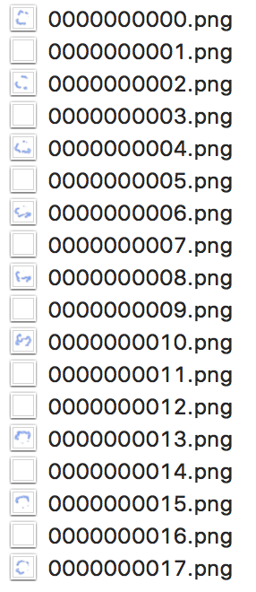

<h1 align="center"> PNG-Sorter </h1>

    
    

## Effect

#### Beofre

    

#### After

    

## Usage

1. `npm i png-sorter -g`

2. `png-sorter <Folder Path>`

## Depend

* [Node.js](https://nodejs.org/en/) (version >= 5.x)
